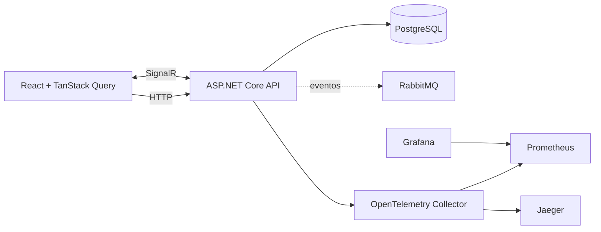

# DevicePulse

DevicePulse é uma plataforma genérica de telemetria para cadastro e acompanhamento de equipamentos. Esta evolução preserva a API do MVP, separa o núcleo de domínio de infraestrutura, introduz PostgreSQL como persistência principal, contratos de eventos, SignalR e uma interface React responsiva.

## Arquitetura



O domínio (`DevicePulse.Domain`) não referencia ASP.NET, EF Core ou RabbitMQ. `DevicePulse.Contracts` contém contratos de integração versionados. A API continua oferecendo as rotas do MVP e usa PostgreSQL fora do ambiente isolado de testes. Consulte [a arquitetura detalhada](docs/architecture.md) e [o modelo de domínio](docs/domain-model.md).

## Estrutura

```text
backend/DevicePulse.Api       API, EF Core, SignalR e health checks
backend/DevicePulse.Domain    entidades, invariantes e simulação puras
backend/DevicePulse.Contracts eventos de integração
backend/DevicePulse.Tests     testes unitários e de integração existentes
frontend/                     React, TypeScript, Vite e TanStack Query
deploy/docker/                telemetria, métricas e dashboards
deploy/kubernetes/base/       Kustomize, Kubernetes e Route OpenShift
docs/                         decisões e operação
```

## Execução local

Pré-requisitos: .NET SDK 8, Node.js 20 e PostgreSQL 16.

```bash
export ConnectionStrings__DevicePulse='Host=localhost;Database=devicepulse;Username=devicepulse;Password=<senha>'
dotnet restore backend/DevicePulse.sln
dotnet run --project backend/DevicePulse.Api
cd frontend && npm install && npm run dev
```

As datas persistidas e os contratos usam UTC. Swagger fica em `http://localhost:5000/swagger`, o frontend Vite em `http://localhost:5173`, readiness em `/health/ready`, liveness em `/health/live` e SignalR em `/hubs/device-updates`.

## Docker Compose

Nenhuma senha real é versionada. Copie o modelo e altere todos os valores antes de iniciar:

```bash
cp .env.example .env
docker compose up --build
docker compose ps
```

| Serviço | Endereço |
|---|---|
| Aplicação | http://localhost:3000 |
| API / Swagger | http://localhost:5000 / http://localhost:5000/swagger |
| RabbitMQ Management | http://localhost:15672 |
| Prometheus | http://localhost:9090 |
| Grafana | http://localhost:3001 |
| Jaeger | http://localhost:16686 |

O volume `devicepulse-postgres` preserva dados entre reinícios. Migrações devem ser aplicadas por um job único antes de aumentar réplicas; não habilite migração automática concorrente em produção.

## Testes e validações

```bash
dotnet restore backend/DevicePulse.sln
dotnet build backend/DevicePulse.sln --configuration Release --no-restore
dotnet test backend/DevicePulse.sln --configuration Release --no-build --collect:'XPlat Code Coverage'
cd frontend
npm install
npm run lint
npm test
npm run build
docker compose config
kubectl kustomize deploy/kubernetes/base
```

## Configuração

| Variável | Obrigatória | Finalidade |
|---|---:|---|
| `ConnectionStrings__DevicePulse` | sim | conexão PostgreSQL |
| `POSTGRES_PASSWORD` | Compose | senha local do PostgreSQL |
| `RABBITMQ_PASSWORD` | Compose | senha local do RabbitMQ |
| `GRAFANA_PASSWORD` | Compose | administrador local do Grafana |
| `JWT_SIGNING_KEY` | autenticação | chave externa, com no mínimo 32 caracteres |
| `DEVICEPULSE_SEED_ADMIN_PASSWORD` | seed opcional | senha do administrador de demonstração |
| `OTEL_EXPORTER_OTLP_ENDPOINT` | observabilidade | endpoint OTLP |

## Implantação

`kubectl apply -k deploy/kubernetes/base` instala a base demonstrativa. Crie previamente o Secret `devicepulse-secrets`; nenhum Secret é fornecido no Git. Os containers declaram execução sem privilégios, limites e probes. PostgreSQL e RabbitMQ incluídos nos manifests são apenas demonstrativos: produção deve usar serviço gerenciado ou operador. Consulte [deployment.md](docs/deployment.md).

## Trade-offs e limitações conhecidas

O repositório mantém os endpoints legados `/api/*` para compatibilidade; a migração completa para `/api/v1` deve ser feita de modo compatível. Os contratos e invariantes da arquitetura final estão separados, porém Identity/JWT, outbox/RabbitMQ, workers independentes, analytics avançado e todas as telas administrativas ainda não estão integrados ao fluxo legado. Essas lacunas são documentadas explicitamente, sem stubs que finjam integração. Veja [architecture.md](docs/architecture.md).

## Licença

[MIT](LICENSE).
