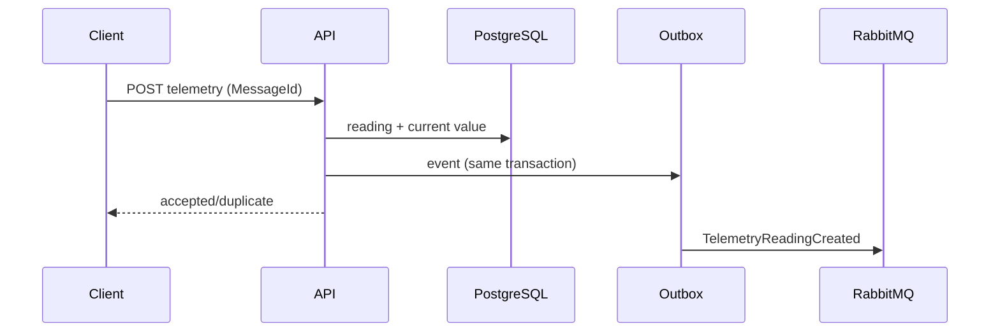

# Arquitetura

## Decisões

O desenho alvo é um monólito modular: API, aplicação e persistência são implantados juntos; simulação e alertas assíncronos podem escalar como workers. O domínio puro protege invariantes sem depender da infraestrutura. PostgreSQL é o system of record; RabbitMQ transporta eventos, nunca telemetria permanente. SignalR é a única via de push ao navegador e não usa Redis backplane.

## Estado entregue e próximos incrementos

O domínio final e contratos de evento estão implementados, a API usa PostgreSQL em execução normal e SQLite somente na suíte legada, e SignalR/health checks/correlation ID estão expostos. Ainda faltam integrar Identity/JWT, persistir outbox, publicar/consumir RabbitMQ, implementar os workers e substituir os endpoints legados pelos módulos completos. O Compose não declara workers enquanto não houver executáveis reais; isso evita uma implantação enganosa.
