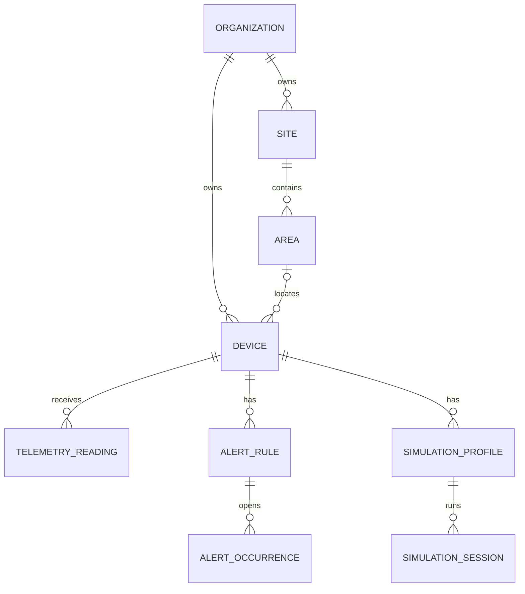

# Modelo de domínio

`Organization` é a fronteira de tenant. `Site` pertence à organização e `Area` ao site. `Device` valida nome, intervalo do simulador e timeout, registra telemetria em UTC e calcula offline. `AlertRule` implementa os sete operadores e valida intervalos. `AlertOccurrence` separa reconhecimento de resolução. `SimulationProfile` contém seis modos e `SimulationSession` modela execução, pausa e parada.

